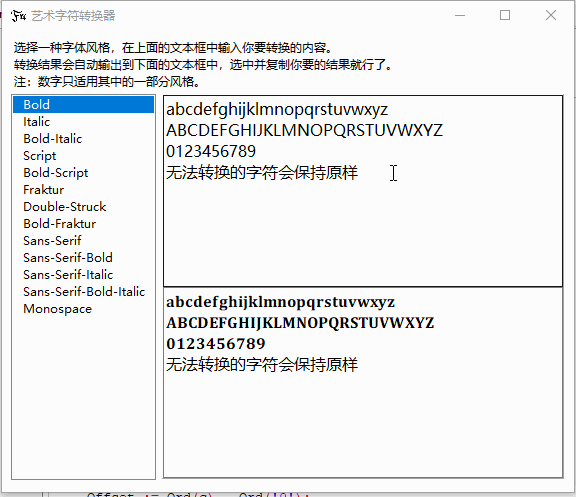

# MAS_CONV
Single executable to convert characters to Unicode Mathematical Alphanumeric Symbols.

艺术字符转换器，将英文字母和数字转换为unicode中对应的手写体、哥特体字符。

# Screen Shot GIF

# Development Environment

Develop with Lazarus and Free Pascal(Delphi)

用Lazarus开发，语言是Free Pascal(Delphi)